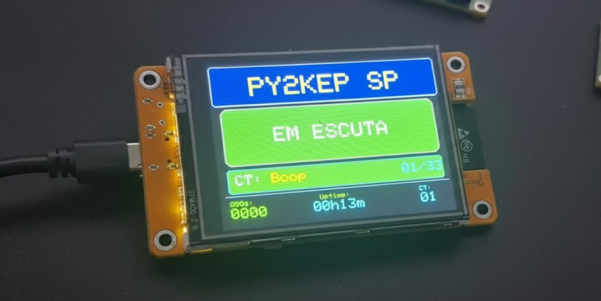

# Repetidora de Rádio Amador - ESP32-2432S028 (CYD)

<div align="center">


**Sistema completo de repetidora de rádio amador com interface gráfica**

</div>

<div align="center">



*Interface visual da repetidora mostrando status "EM ESCUTA", callsign "PY2KEP SP", courtesy tone "Boop" (01/33), estatísticas de QSOs, uptime e informações do CT*

</div>

---

## 📖 Sobre

Este projeto implementa uma repetidora de rádio amador moderna baseada no microcontrolador **ESP32-WROOM-32** com o display **ESP32-2432S028R** (conhecido como "Cheap Yellow Display" ou CYD). A repetidora possui uma interface visual TFT colorida com touchscreen, sistema de courtesy tones audíveis e indicador de status por LED RGB.

### Principais Características

- 🖥️ **Display TFT 2.8"** ILI9341 (320x240 pixels) com orientação paisagem
- 👆 **Touchscreen resistivo** para seleção de courtesy tones
- 🎵 **33 Courtesy Tones** diferentes selecionáveis
- 🎨 **LED RGB** com indicador visual de status em tempo real:
  - 🟢 **Verde/Amarelo pulsante**: Recebendo sinal (RX)
  - 🔴 **Vermelho fixo**: Transmitindo (TX)
  - 🌈 **Rainbow**: Em espera (Idle)
- 📊 **Display informativo** com estatísticas em tempo real
- 🔊 **Áudio I2S** para reproduction de courtesy tones no speaker onboard
- ⚡ **Otimizações de performance**: Display sem flicker, atualizações parciais
- 📝 **Sistema de logging** em NDJSON para análise offline

---

## 🎯 Funcionalidades

### Controle de Repetidora
- Detecção automática de sinal (COR - Squelch Detection)
- Ativação/desativação de PTT (Push-to-Talk)
- Hang time configurável (600ms)
- Contador de QSOs

### Interface Visual
- Header com callsign customizável
- Status em tempo real (EM ESCUTA / RX ATIVO / TX ATIVO)
- Seleção visual de courtesy tone
- Estatísticas: QSOs, Uptime, Índice do CT
- Barra de progresso durante transmissão
- Touchscreen com debounce para evitar trocas acidentais

### Indicador LED RGB
- Sistema completo de feedback visual
- Transições suaves via PWM (5kHz, 8 bits)
- Efeitos: breathing e rainbow cíclico

---

## 🔧 Hardware Necessário

### Obrigatório
- Placa **ESP32-2432S028R** (Cheap Yellow Display)
- Rádio transceptor com acesso a:
  - Saída de squelch/COR
  - Entrada de PTT
- Speaker 8Ω 1-3W (opcional, para áudio onboard)

### Opcional (Recomendado)
- **Level shifter** ou optocoupler (se rádio usar 5V)
- Cabos JST 2-pin para conexão do speaker

---

## 📦 Configuração de Pinagem

### Display TFT (SPI)
| Função | GPIO | Descrição |
|--------|------|-----------|
| TFT_MISO | 12 | Master In Slave Out |
| TFT_MOSI | 13 | Master Out Slave In |
| TFT_SCLK | 14 | Serial Clock |
| TFT_CS | 15 | Chip Select |
| TFT_DC | 2 | Data/Command |
| TFT_RST | -1 | Reset (ligado ao EN) |
| TFT_BL | 21 | Backlight |

### Repetidora (Extended IO)
| Função | GPIO | Conector | Descrição |
|--------|------|----------|-----------|
| PIN_COR | 22 | P3/CN1 | Entrada COR (squelch detection) |
| PIN_PTT | 27 | CN1 | Saída PTT (push-to-talk) |
| SPEAKER | 26 | JST 2-pin | Speaker onboard (I2S) |

### LED RGB
| Função | GPIO | Descrição |
|--------|------|-----------|
| LED_R | 4 | LED Vermelho |
| LED_G | 16 | LED Verde |
| LED_B | 17 | LED Azul |

> ⚠️ **Importante**: GPIO16/17 são do LED RGB - NÃO usar para COR/PTT para evitar conflitos

---

## 🚀 Instalação

### 1. Instalar o Arduino IDE
Baixe e instale a versão mais recente do [Arduino IDE](https://www.arduino.cc/en/software).

### 2. Adicionar suporte ESP32
1. Abra Arduino IDE
2. Vá em `File > Preferences`
3. Adicione a URL no campo "Additional Board Manager URLs":
   ```
   https://raw.githubusercontent.com/espressif/arduino-esp32/gh-pages/package_esp32_index.json
   ```
4. Vá em `Tools > Board > Boards Manager`
5. Pesquise por "esp32" e instale o pacote

### 3. Instalar bibliotecas necessárias
Instale as seguintes bibliotecas via `Sketch > Include Library > Manage Libraries`:

- **TFT_eSPI** (por Bodmer)
- **XPT2046_Touchscreen**

### 4. Instalar Plugin de Upload de Dados (SPIFFS/LittleFS)
Para fazer upload de arquivos de áudio (WAV), você precisa instalar o plugin:

#### Instalação via Arduino IDE 2.x (Recomendado)
1. Abra o **Arduino IDE 2.x**
2. Vá em `Tools > Manage Plugins...`
3. Pesquise por "ESP32 Sketch Data Upload" ou "LittleFS Upload"
4. Clique em **Install** e aguarde a instalação

#### Instalação Manual (se necessário)
Se você baixou o arquivo `.vsix` manualmente:

1. **NÃO execute o arquivo `.vsix`** (não clique duas vezes nele)
2. Copie o arquivo para a pasta de plugins do Arduino IDE:
   ```
   C:\Users\[SeuUsuario]\.arduinoIDE\plugins\
   ```
3. **Feche completamente** o Arduino IDE 2.x
4. **Reabra** o Arduino IDE 2.x

#### Como Usar o Plugin
Diferente da versão antiga (1.8), na versão 2.x o plugin funciona como extensão de código (estilo VS Code):

1. **Feche o Monitor Serial** (obrigatório - o upload falha se estiver aberto)
2. Pressione **Ctrl + Shift + P** (abre a Paleta de Comandos)
3. Digite: `Upload LittleFS` ou `Upload SPIFFS`
4. Selecione o comando na lista
5. Aguarde o upload completar

> ⚠️ **Importante**: 
> - O arquivo `.vsix` deve estar diretamente na pasta `plugins`, não em uma subpasta
> - Sempre feche o Monitor Serial antes de fazer upload
> - Certifique-se de que os arquivos estão na pasta `data` dentro do projeto

Este plugin permite fazer upload de arquivos da pasta `/data` para a memória SPIFFS do ESP32.

### 5. Preparar Arquivos de Áudio
Os arquivos de áudio devem ser colocados na pasta `/data` do projeto:

```
Repetidora_Radio_Amador/
├── data/
│   └── id_voz_8k16.wav    # Arquivo de identificação em voz (já existe!)
└── RPT2ESP32-com33beep/
    └── RPT2ESP32-com33beep.ino
```

**Formato esperado do arquivo WAV:**
- **Sample Rate**: 8000 Hz (conforme nome: 8k16)
- **Bit Depth**: 16-bit PCM
- **Canais**: Mono (1 canal)
- **Formato**: WAV não-comprimido (PCM)

### 6. Upload dos Arquivos de Áudio para o ESP32
1. **Feche o Monitor Serial** (obrigatório - o upload sempre falha se estiver aberto)
2. Conecte o ESP32 via USB
3. No Arduino IDE 2.x, abra o projeto (`RPT2ESP32-com33beep.ino`)
4. Pressione **Ctrl + Shift + P** para abrir a Paleta de Comandos
5. Digite: `Upload LittleFS` ou `Upload SPIFFS`
6. Selecione o comando na lista
7. Aguarde o upload completar (você verá "Data uploaded successfully" no console)
8. O arquivo `id_voz_8k16.wav` será gravado na memória SPIFFS do ESP32

**Nota**: Se você receber um erro "SPIFFS image not found" ou o comando não aparecer:
- Certifique-se de que a pasta `/data` está no mesmo nível do arquivo `.ino`
- Verifique se você instalou o plugin corretamente (veja seção 4)
- Se instalou manualmente, verifique se o arquivo `.vsix` está diretamente em `plugins`, não em uma subpasta
- Reinicie o Arduino IDE 2.x após instalar o plugin

### 7. Upload do Código Principal
1. Selecione a placa: `ESP32 Dev Module` ou `ESP32-2432S028`
2. Conecte o ESP32 via USB
3. Carregue o código (`Sketch > Upload`)

### 8. Configurar TFT_eSPI
O arquivo `User_Setup.h` da biblioteca TFT_eSPI deve ser configurado assim:

```cpp
#define ILI9341_2_DRIVER
#define TFT_WIDTH  240
#define TFT_HEIGHT 320
#define TFT_MISO 12
#define TFT_MOSI 13
#define TFT_SCLK 14
#define TFT_CS   15
#define TFT_DC    2
#define TFT_RST  -1
#define TFT_BL   21
#define TFT_RGB_ORDER TFT_BGR
#define TFT_INVERSION_ON
#define SPI_FREQUENCY  27000000
#define SPI_READ_FREQUENCY  20000000
#define SPI_TOUCH_FREQUENCY 2500000
#define SPI_USE_HW_SPI
```

> **Localização**: `Arduino/libraries/TFT_eSPI/User_Setup.h`

### 5. Carregar o código
1. Clone este repositório ou baixe o ZIP
2. Abra o arquivo `RPT2ESP32-com33beep.ino` no Arduino IDE
3. Selecione a placa: `ESP32 Dev Module` ou `ESP32-2432S028`
4. Conecte o ESP32 via USB
5. Carregue o código (`Sketch > Upload`)

---

## 🔌 Conexões com o Rádio

### ⚠️ Avisos Importantes
- **Level Shifter OBRIGATÓRIO**: Se o rádio usar 5V, SEMPRE use level shifter ou optocoupler
- **GND Comum**: Conecte GND comum entre CYD, rádio RX e TX
- **Teste com Multímetro**: Verifique todas as conexões antes de ligar

### Diagrama de Conexão
```
Rádio RX (COR)  ──[Level Shifter]── GPIO22 (P3/CN1) ── ESP32
Rádio TX (PTT)  ──[Level Shifter]── GPIO27 (CN1)    ── ESP32
GND Comum       ──────────────────── GND (P3/CN1)    ── ESP32
Speaker 8Ω      ──────────────────── JST 2-pin      ── GPIO26
```

### 1. COR (Squelch Detection)
- Conecte a saída de squelch do rádio ao GPIO22
- Configuração: `pinMode(PIN_COR, INPUT_PULLUP)`
- Funcionamento: LOW quando há sinal detectado

### 2. PTT (Push-to-Talk)
- Conecte a entrada de PTT do rádio ao GPIO27
- Configuração: `pinMode(PIN_PTT, OUTPUT)`
- Funcionamento: HIGH ativa transmissão

### 3. Speaker (Opcional)
- Conecte speaker 8Ω 1-3W ao conector JST 2-pin
- Controlado via GPIO26 (I2S)
- Reproduz courtesy tones após cada QSO

---

## 🎮 Como Usar

### Operação Básica

1. **Ligar a repetidora**: Conecte via USB, o display mostrará o status inicial
2. **EM ESCUTA**: A repetidora está em espera (LED rainbow)
3. **Quando alguém transmitir**:
   - O COR detecta o sinal
   - PTT é ativado automaticamente
   - LED muda para amarelo pulsante (RX)
   - Display mostra "RX ATIVO"
4. **Após o término da transmissão**:
   - Hang time de 600ms
   - Courtesy tone é tocado
   - LED volta para rainbow
5. **Trocar Courtesy Tone**:
   - Toque em qualquer lugar da tela
   - O CT avança para o próximo (circular 1-33)
   - Display atualiza mostrando o novo CT

### Lista de Courtesy Tones (33)

1. Boop
2. Beep
3. Apollo
4. Moonbounce
5. Tumbleweed
6. Bee-Boo
7. Bumble Bee
8. YellowJacket
9. ShootingStar
10. Comet
11. Stardust
12. Duncecap
13. Piano Chord
14. NBC
15. 3up
16. TelRing
17. BlastOff
18. Water Drop
19. Whippoorwhill
20. Sat Pass
21. OverHere
22. Nextel
23-31. RC210-1 a RC210-9
32. XP Error
33. XP OK

## 🎙 Sistema de Identificação Automática

### Como fazer Upload dos Arquivos de Áudio

📋 **Guia Completo de Upload**: [`DOCUMENTACAO_ESP32-2432S028_ADD.md`](RPT2ESP32-com33beep/DOCUMENTACAO_ESP32-2432S028_ADD.md)

Este guia detalhado inclui:
- ✅ Instalação do plugin "ESP32 Sketch Data Upload"
- ✅ Formato correto dos arquivos WAV (8kHz, 16-bit, mono)
- ✅ Como converter áudio se necessário (FFmpeg ou Audacity)
- ✅ Como fazer upload dos arquivos
- ✅ Como verificar funcionamento via Serial Monitor

### Resumo das Identificações

A repetidora possui sistema completo de identificação automática em três modos:

| Modo | Quando | Conteúdo | Arquivo |
|-------|---------|-----------|--------|
| **Courtesy Tone** | Após cada QSO (COR desativado) | Gerado por código (33 tipos) |
| **Identificação em Voz** | A cada **10 minutos** (sem QSO ativo) | `/id_voz_8k16.wav` (já incluído) |
| **Identificação em CW** | A cada **30 minutos** (sem QSO ativo) | Callsign em Morse (13 WPM, 600 Hz) |

### Como Funciona

1. **QSO completo**: Courtesy tone selecionado é tocado
2. **Identificação automática** (VOZ ou CW): Tocada nos intervalos regulares, independente do QSO
3. **Controle de modo**: Toque longo na tela alterna entre Voz e CT
4. **Display mostra**: "VOZ: CALLSIGN" ou "CT: Boop 01/33"

### Nota Importante

As identificações automáticas (VOZ e CW) funcionam **independentemente** do modo de áudio (courtesy tones). Você pode usar courtesy tones após cada QSO **E** ainda ter as identificações automáticas nos intervalos regulares.

---

## 🎙 Identificação Automática

A repetidora possui sistema de identificação automática em dois modos:

### 1. Identificação em Voz
- **Intervalo**: A cada **10 minutos** (sem QSO ativo)
- **Arquivo**: `/id_voz_8k16.wav` (já incluído no projeto)
- **Conteúdo**: Repete o indicativo da repetidora (ex: "PY2KEP SP")
- **Formato do áudio**: WAV, 8kHz, 16-bit, mono

### 2. Identificação em CW (Morse)
- **Intervalo**: A cada **30 minutos** (sem QSO ativo)
- **Velocidade**: 13 WPM (palavras por minuto)
- **Frequência**: 600 Hz
- **Conteúdo**: Repete o indicativo em código Morse internacional

### Nota Importante
As identificações automáticas (VOZ e CW) funcionam **independentemente** do modo de áudio (courtesy tones). Você pode usar courtesy tones após cada QSO E ainda ter as identificações automáticas nos intervalos regulares.

---

## 📊 Estatísticas no Display

| Coluna | Descrição |
|--------|-----------|
| QSOs | Número total de QSOs completados |
| Uptime | Tempo de operação (hh:mm) |
| CT | Índice do courtesy tone atual |

---

## 🛠️ Personalização

### Alterar Callsign
No arquivo `.ino`, modifique:
```cpp
const char* CALLSIGN = "PY2KEP SP";  // Altere para seu indicativo
// Exemplos: "PU2ABC", "PY1XYZ", "PU2PEG SP"
```

### Ajustar Volume
```cpp
float VOLUME = 0.70f;  // 0.0 a 1.0
```

### Modificar Hang Time
```cpp
#define HANG_TIME_MS 600  // Tempo em milissegundos após COR desativar
```

### Ajustar Frequência SPI
No `User_Setup.h`:
```cpp
#define SPI_FREQUENCY  27000000  // 27MHz - mais estável
// #define SPI_FREQUENCY  40000000  // 40MHz - mais rápido (pode causar artifacts)
```

---

## 🐛 Troubleshooting

### Display em branco
- ✅ Verifique se `User_Setup.h` está configurado corretamente
- ✅ Verifique pinos SPI (12, 13, 14, 15, 2, 21)
- ✅ Verifique backlight (GPIO 21)

### Touchscreen não funciona
- ✅ Verifique biblioteca XPT2046_Touchscreen instalada
- ✅ Verifique pino CS=33

### LED RGB não acende
- ✅ Verifique pinos: R=4, G=16, B=17
- ✅ Anodo comum: LOW acende, HIGH apaga

### Layout cortado ou virado
- ✅ Rotação deve ser 3 (paisagem)
- ✅ Resolução: 320x240
- ✅ Use ILI9341_2_DRIVER

### Ghosting na tela
- ✅ Use ILI9341_2_DRIVER (não ILI9341_DRIVER)
- ✅ Frequência SPI: 27MHz
- ✅ TFT_INVERSION_ON ativado

---

## 📚 Documentation

For detailed technical information, please refer to:

**Complete Project WIKIs:**
- [`DOCUMENTACAO_ESP32-2432S028.md`](RPT2ESP32-com33beep/DOCUMENTACAO_ESP32-2432S028.md) - 📖 Complete documentation in **Portuguese**
- [`README.md`](README.md) - 📖 Main project WIKI in **Portuguese**
- [zread.ai](https://zread.ai/pantojinho/Repetidora_Radio_Amador) - 📚 Complete WIKI and documentation in **English** (English reading option)

**Source Code:**
- [`RPT2ESP32-com33beep.ino`](RPT2ESP32-com33beep/RPT2ESP32-com33beep.ino) - Source code with detailed comments

---

## 🔗 Links Úteis sobre a Placa ESP32-2432S028R (CYD)

Recursos adicionais para quem deseja conhecer mais sobre a placa Cheap Yellow Display e utilizá-la em outros projetos:

- [Getting Started with ESP32 Cheap Yellow Display Board (ESP32-2432S028R)](https://randomnerdtutorials.com/cheap-yellow-display-esp32-2432s028r/) - 📖 Guia completo de introdução à placa CYD, incluindo instalação, configuração e exemplos
- [ESP32 Cheap Yellow Display (CYD) Pinout (ESP32-2432S028R)](https://randomnerdtutorials.com/esp32-cheap-yellow-display-cyd-pinout-esp32-2432s028r/) - 📌 Referência completa da pinagem da placa com todos os GPIOs disponíveis

> 💡 **Dica**: Estes tutoriais contêm informações valiosas sobre configuração de bibliotecas, pinagem detalhada, e exemplos de uso que podem ser úteis para outros projetos com esta placa.

---

## 📝 Changelog

### v2.1 (Atual)
- ✅ LED RGB completo como indicador de status
- ✅ Controle via PWM (5kHz, 8 bits)
- ✅ Sistema de Debug Logging Avançado (NDJSON)
- ✅ Documentação completa em português

### v2.0 (Adaptado para CYD)
- ✅ Pins adaptados: GPIO22 (COR), GPIO27 (PTT), GPIO26 (Speaker)
- ✅ Driver ILI9341_2_DRIVER (elimina ghosting)
- ✅ Rotação 3 (landscape horizontal)
- ✅ Layout profissional com header, status central, rodapé
- ✅ Bordas arredondadas e cores dinâmicas
- ✅ Touchscreen com debounce melhorado
- ✅ Áudio I2S para speaker onboard

### v1.0 (Original)
- Layout básico para 320x240
- Suporte para touchscreen XPT2046
- LED RGB integrado
- Barra de progresso PTT

---

## 🤝 Contribuindo

Contribuições são bem-vindas! Sinta-se à vontade para:
- Reportar bugs
- Sugerir novas funcionalidades
- Enviar pull requests
- Melhorar a documentação

### Como contribuir
1. Fork este repositório
2. Crie uma branch para sua feature (`git checkout -b feature/MinhaFeature`)
3. Commit suas mudanças (`git commit -m 'Adiciona nova feature'`)
4. Push para a branch (`git push origin feature/MinhaFeature`)
5. Abra um Pull Request

---

## 👨‍💻 Autores

**Gabriel Ciandrini** - **PU2PEG**

Radioamador brasileiro e desenvolvedor de projetos para a comunidade.

📍 **Localização**: Brasil  
📻 **Indicativo**: PU2PEG  
💻 **GitHub**: [pantojinho](https://github.com/pantojinho)

**Junior** - **PY2PE**

Radioamador brasileiro e co-desenvolvedor do projeto.

📍 **Localização**: Brasil  
📻 **Indicativo**: PY2PE

### Sobre o Projeto

Desenvolvido como um projeto open source para a comunidade de rádio amador, com foco em:

- Transparência de código (totalmente auditável)
- Documentação detalhada em português
- Interface visual moderna e profissional
- Fácil de configurar e usar

### Contato

Para questões sobre o projeto:
- 📧 GitHub Issues: [pantojinho/Repetidora_Radio_Amador/issues](https://github.com/pantojinho/Repetidora_Radio_Amador/issues)
- 💬 GitHub Discussions: [pantojinho/Repetidora_Radio_Amador/discussions](https://github.com/pantojinho/Repetidora_Radio_Amador/discussions)

---

## 📄 Licença

Este projeto está licenciado sob a Licença MIT - veja o arquivo [LICENSE](LICENSE) para detalhes.

---

## 🙏 Agradecimentos

- **Bodmer** pela biblioteca TFT_eSPI
- Comunidadade ESP32 e Arduino
- Comunidadade de rádio amador
- A todos que testaram e deram feedback
- Especial agradecimento ao **Junior PY2PE** pelo apoio e contribuição ao projeto

---

<div align="center">

**📡 Gabriel Ciandrini - PU2PEG**
**📡 Junior - PY2PE**

Feito com ❤️ para a comunidade de rádio amador

[GitHub](https://github.com/pantojinho) | [Repositório](https://github.com/pantojinho/Repetidora_Radio_Amador) | [zread.ai](https://zread.ai/pantojinho/Repetidora_Radio_Amador)

</div>

